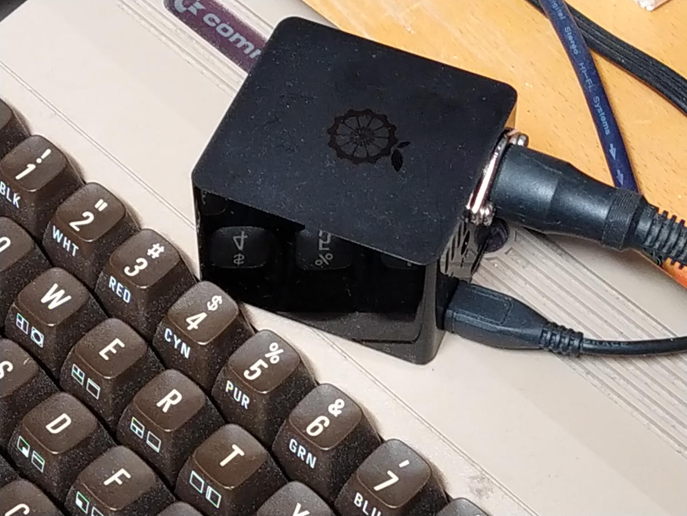
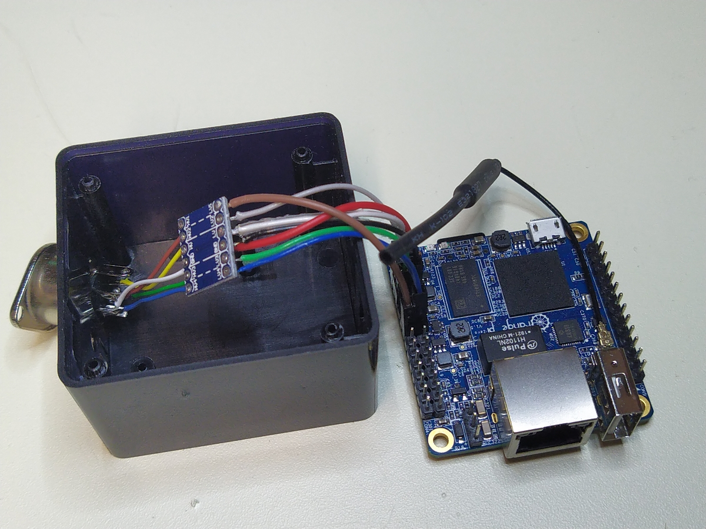
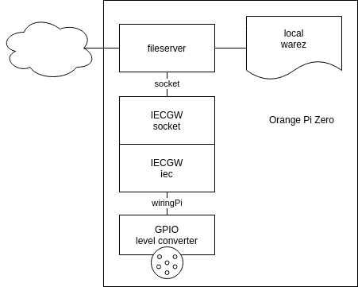

# iecgw
Gateway to Commodore IEC world




 * No fastloaders
 * Somewhat unreliable
 * Limited support for 1541 dos functions
 * Simple pi1541 hardware
 * OragePi Zero with Armbian. Might work with others, too
 * No Raspberry Pi Zero. Needs multicore.
 * Realtime-ish setup in user space, with a dedicated cpu
 * Full linux networking and services
 * Easyish python server code



```
IEC code copied from SD2IEC https://www.sd2iec.de/
Hardware is like Pi1541 https://cbm-pi1541.firebaseapp.com/
Some ideas from uno2iec https://github.com/Larswad/uno2iec
Python d64 code from https://eden.mose.org.uk/gitweb/?p=python-d64.git;a=summary
```

# Socket Protocol

All socket messages consists of 3-257 bytes
 * 1 byte command
 * 1 byte secondary/device
 * 1 bytes data length
 * 0-255 bytes data

## IEC ->
 * I Initialize.
    Expects response
 * P Dos command. Same as Open.
 * O Open
 * C Close
 * R Read.
  Expects response
 * W Write
 * D Debug

## -> IEC
 * I Initialize response for Initialize.
    secondary/device is the device number to be used
 * : Error status for Read
 * B Bytes response for Read
 * E Bytes response for Read with end of file

# Compile and use
```
cd src
make
sudo ./iecgw &

cd ..
sudo pip3 install d64
./fileserver.py
./printserver.py
```

# TODO
 * Add leds
 * Add 1541/sd2iec dos commands
 * Host mode

